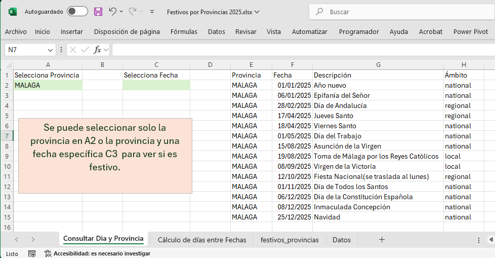
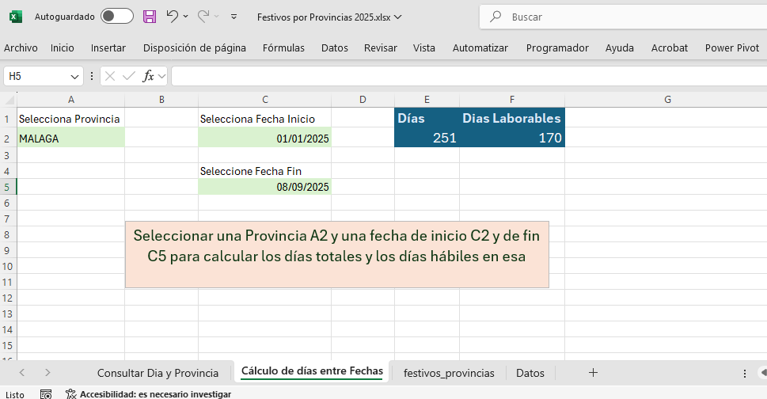

# Calendario de Festivos de España

Este proyecto genera un fichero CSV con los días festivos de todas las provincias de España para un año específico, utilizando la librería `holidays_es`.

## Características

- Genera un listado de festivos nacionales, autonómicos y locales.
- El resultado se guarda en un fichero CSV para su fácil uso en otras aplicaciones.
- Incluye un fichero Excel de ejemplo (`docs/Festivos por Provincias 2025.xlsx`) que muestra cómo utilizar los datos generados. Este fichero permite:
    - Consultar los días festivos de una provincia.
      
    - Comprobar si una fecha concreta es festivo en una provincia.
    - Calcular los días naturales y laborables entre dos fechas para una provincia seleccionada.
      

## Instalación

1.  Clona este repositorio:
    ```bash
    git clone https://github.com/davidbuenov/dbv-dias-festivos.git
    cd dbv-dias-festivos
    ```

2.  Crea un entorno virtual e instálalo:
    ```bash
    python -m venv venv
    venv\Scripts\activate
    ```

3.  Instala las dependencias:
    ```bash
    pip install -r src/requirements.txt
    ```

## Uso

Ejecuta el script desde el directorio raíz del proyecto.

**Para el año actual:**
```bash
python src/DiasFestivos.py
```

**Para un año específico:**
```bash
python src/DiasFestivos.py --year 2026
```

El script generará un fichero con el formato `festivos_provincias_AAAA.csv` en la carpeta `data`. También puedes ver la ayuda del script con el comando:
```bash
python src/DiasFestivos.py --help
```

## Ficheros del proyecto

-   `src/DiasFestivos.py`: El script principal que genera los festivos.
-   `src/requirements.txt`: Las dependencias de Python.
-   `data/festivos_provincias_2025.csv`: Fichero de ejemplo con los festivos del 2025.
-   `docs/IB.4. Festivos por Provincias.xlsx`: Fichero Excel que utiliza los datos del CSV.

## Agradecimientos

-   A los creadores del paquete [holidays-es](https://pypi.org/project/holidays-es/) por su excelente trabajo.
-   A [calendarioslaborales.net](https://calendarioslaborales.net/) por la información de los festivos.
-   El código inicial fue generado con la ayuda de Microsoft Copilot y la estructura del repositorio fue preparada con la ayuda de Gemini.

## Autor

David Bueno - [davidbuenov.com](https://davidbuenov.com)
